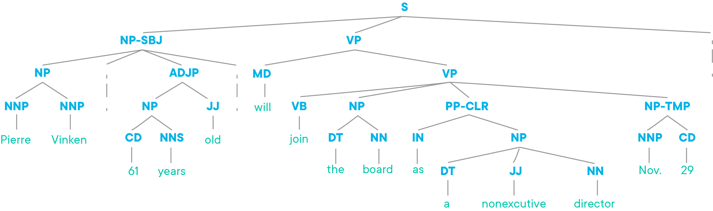

# Introduction to NLP with NLTK

## Introduction

In this lesson, we'll discuss a general overview of Natural Language Processing, and the popular Python library for NLP, **_Natural Language Tool Kit_** (NLTK).

## Objectives

You will be able to:

* Identify ways we can use NLTK to simplify and accelerate common preprocessing tasks for text data

## What is Natural Language Processing?

**_Natural Language Processing_**, or **_NLP_**, refers to analytics tasks that deal with natural human language, in the form of text or speech. These tasks usually involve some sort of machine learning, whether for text classification or for feature generation, but NLP isn't just machine learning. Tasks such as text preprocessing and cleaning also fall under the NLP umbrella. 

The most common Python library used for NLP tasks is **_Natural Language Tool Kit_**, or NLTK for short. This library was developed by researchers at the University of Pennsylvania, and quickly became the most powerful and complete library of NLP tools available. 

## Using NLTK

NLTK is a sort of "one-stop shop" for all things NLP. It contains many sample corpora, with everything from full texts from Project Gutenberg to transcripts of State of the Union speeches from US Presidents. This library contains functions and tools for everything from data cleaning and preprocessing, to linguistic analysis, to feature generation and extraction. NLTK even contains its own Bayesian classifiers for quick testing (although realistically, you'll likely want to continue using scikit-learn for these sorts of tasks). 

NLP is unique in that in addition to statistics and math, it also relies heavily on the field of **_Lingustics_**. Many of the concepts you'll run into will be grounded in linguistics. Some of them will seem a bit foreign to you if you haven't studied languages or grammar yet, but don't worry! The reality of it all is that you don't need deep expertise in linguistics to work with text data, because NLTK was built by professionals to make it easier for everyone to access the linguistic tools and methods needed for working with text data. Although a linguist knows how to manually generate something like a **_Parse Tree_** for a sentence, NLTK provides this functionality for you in just a few lines of code. 

**A sample Parse Tree created with NLTK**

  

    
    
    

## Working With Text, Simplified

Generally, projects that work with text data follow the same overall pattern as any other projects. The main difference is that text projects usually require a bit more cleaning and preprocessing than regular data, in order to get the text into a format that's usable for modeling. 

Here are some of the ways that NLTK can make our lives easier when working with text data:

- **_Stop Word Removal_**: NLTK contains a full library of stop words, making it easy to remove the words that don't matter from our data.    

- **_Filtering and Cleaning_**: NLTK provides simple, easy ways to create and filter frequency distributions, as well providing multiple ways to clean, stem, lemmatize, or tokenize datasets.   

- **_Feature Selection and Feature Engineering_**: NLTK contains tools to quickly generate features such as bigrams and n-grams. It also contains major libraries such as the **_Penn Tree Bank_** to allow quick feature engineering, such as generating part-of-speech tags, or sentence polarity. 

Again, don't worry if you're not sure what things like 'lemmatize' mean yet -- we'll cover all of that soon! With effective use of NLTK, we can quickly process and work with text data, allowing us to quickly get our data into the shape needed for tasks we're familiar with, such as classification!

For the remainder of this section, we're going to spend some time getting comfortable with NLTK, while also learning about foundational concepts of linguistics that underpin many of the tasks in NLP. We'll learn to effectively use NLTK to clean and preprocess data in a variety of ways. We'll gain some practice filtering data with regular expressions, generate text statistics to compare text documents, and quickly engineer features to help us better train classifiers for text classification!

## Summary

In this lesson, we learned about what NLP is, and how the NLTK package can save us time and make us more effective when working with text data. 
